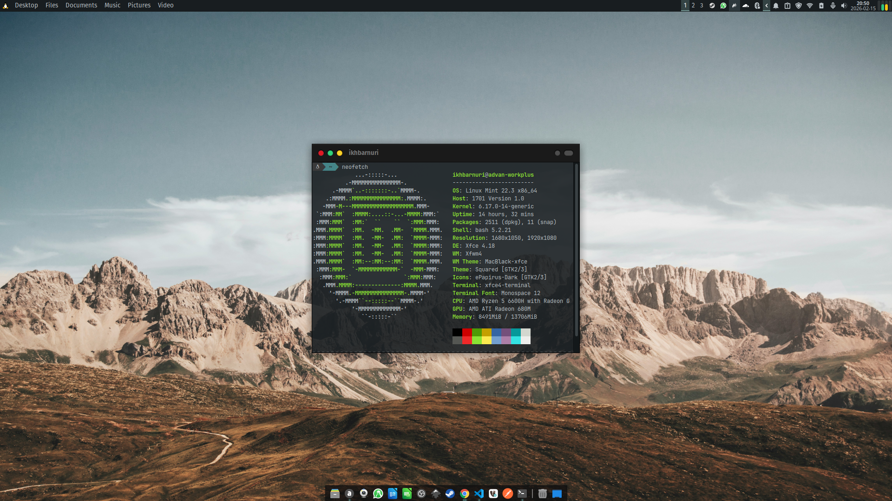

# Xfwm4 Theme - Mac Black Squared

Tema Xfwm4 dengan desain mengotak dan inspirasi macOS.

Modifikasi dari [MacBlack-xfce](https://github.com/rogierreerink/MacBlack-xfce).

## Preview



## Instalasi

```bash
cp -r ./mac-black-squared ~/.themes/
```

Pilih tema **mac-black-squared** di Settings > Window Manager.

## Uninstall

Hapus folder tema:

```bash
rm -rf ~/.themes/mac-black-squared
```